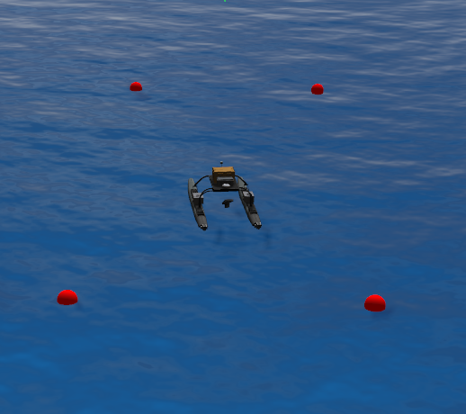

# wamv_speed_control

This package provides a simple speed control (surge, sway, yaw) for wamv T configuration, providing a cmd_vel topic as an interface. This is the basic functionality to use some high-level navigation packages, such as the [navigation_stack](http://wiki.ros.org/navigation).

> before running the tests, build and source your vrx environment. This stack runs with the [vrx 1.3.0](https://github.com/osrf/vrx/tree/1.3.0)

## Test the speed_control

Build and source the wamv_speed_control package. run:

    roslaunch vrx_speed_ctrl pose_control_world.launch

send commands to cmd_vel:

    rostopic pub -r 10 /wamv/cmd_vel geometry_msgs/Twist "linear:
    x: 1.0
    y: 1.0
    z: 0.0
    angular:
    x: 0.0
    y: 0.0
    z: 1.0"

## Test the openai_example project

This uses openai reinforcement learning in a simple task environment.

    roslaunch vrx_speed_ctrl vrx_loc_world.launch
    roslaunch wamv_openai_ros_example start_training.launch

the task environment:

If you add:

    <physics type="ode">
      <real_time_update_rate>0</real_time_update_rate>
    </physics>

to *vrx_gazebo/worlds/ocean.world.xacro* and rebuild your vrx environment the simulation will run faster than real-time (as fast as your machine can run it).
